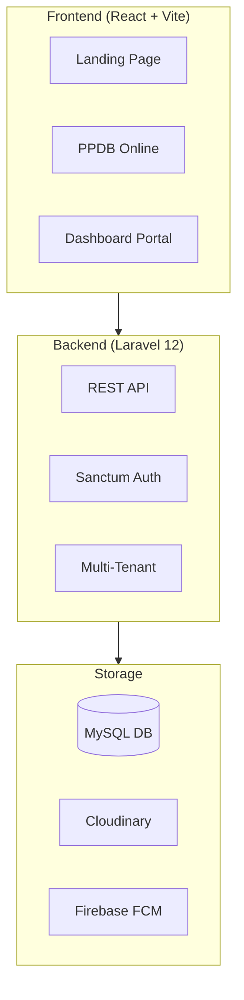
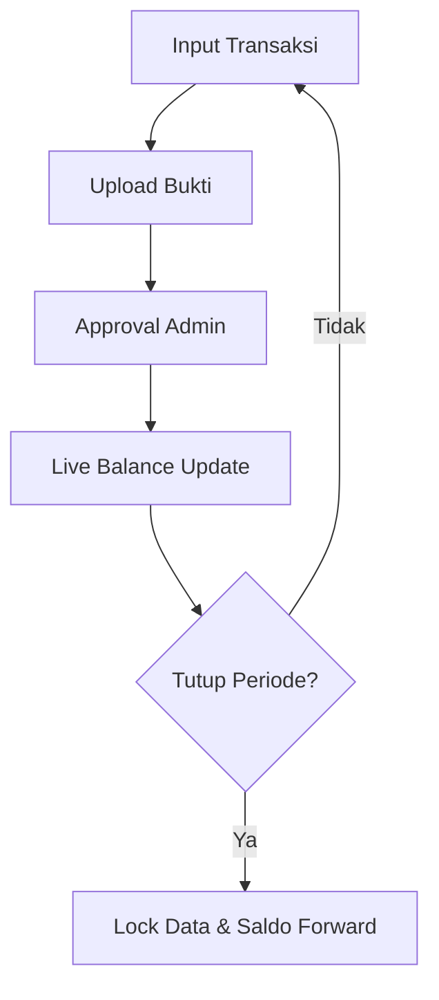
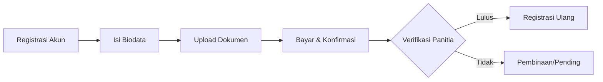

# PISANTRI - Dokumentasi Sistem Lengkap

> **Pesantren Information System and Training Resource Integration**
> Sistem Informasi Pesantren Modern Terintegrasi

---

## 📋 Daftar Isi

| # | Deskripsi | Link |
|---|-----------|------|
| 1 | 🎯 **Visi & Misi Digitalisasi** | [Lihat](#visi--misi-digitalisasi) |
| 2 | 🔄 **Masalah yang Kami Selesaikan** | [Lihat](#masalah-yang-kami-selesaikan) |
| 3 | 💡 **Solusi Nyata** | [Lihat](#solusi-nyata-tantangan-pendidikan-modern) |
| 4 | 📈 **Analisis Efisiensi & Dampak** | [Lihat](#analisis-efisiensi--dampak) |
| 5 | 📊 **Ringkasan Sistem** | [Lihat](#ringkasan-sistem) |
| 6 | 🏗️ **Arsitektur Aplikasi** | [Lihat](#arsitektur-aplikasi) |
| 7 | 🎓 **Modul Akademik & Tahfidz** | [Lihat](#modul-akademik--tahfidz) |
| 8 | 🛡️ **Modul Pembinaan & Tata Tertib** | [Lihat](#modul-pembinaan--tata-tertib) |
| 9 | 🏠 **Modul Asrama & Operasional** | [Lihat](#modul-asrama--operasional) |
| 10 | 💰 **Modul Keuangan & Donasi** | [Lihat](#modul-keuangan--donasi) |
| 11 | 🛒 **Modul Koperasi & Cashless** | [Lihat](#modul-koperasi--cashless-system) |
| 12 | 📝 **Modul PPDB Online** | [Lihat](#modul-ppdb-online) |
| 13 | 👥 **Portal Berdasarkan Role** | [Lihat](#portal-berdasarkan-role) |
| 14 | 🤖 **AI Assistant (Pisantri AI)** | [Lihat](#🤖-ai-assistant-pisantri-ai) |
| 15 | ⚙️ **Siklus Operasional Utama** | [Lihat](#siklus-operasional-utama) |
| 15 | 🚀 **Fitur Lanjutan & Integrasi** | [Lihat](#fitur-lanjutan--integrasi-sistem) |
| 16 | 🛠️ **Manajemen Tata Kelola** | [Lihat](#manajemen-tata-kelola--pengaturan) |
| 17 | 📅 **Rutinitas Digital Santri** | [Lihat](#eksperiens-pengguna-rutinitas-digital) |
| 18 | 🆘 **Pemeliharaan & Bantuan** | [Lihat](#pemeliharaan--bantuan) |

---

## 🎯 Visi & Misi Digitalisasi

> [!IMPORTANT]
> **Visi Utama**: "Semua Masalah Pesantren, Selesai Dalam Satu Platform."

PISANTRI hadir untuk merampingkan kompleksitas pengelolaan pesantren modern. Kami membangun bukan sekadar aplikasi, melainkan **Ekosistem Digital Terpadu**.

| Pilar Strategis | Deskripsi |
|:---:|---|
| 🏛️ **Transparansi** | Membangun kepercayaan orang tua melalui akses data 24/7. |
| 💳 **Kemandirian** | Ekosistem cashless untuk edukasi finansial dan keamanan. |
| 💎 **Kualitas** | Standarisasi pengajaran dengan monitoring yang terukur. |
| 🩺 **Mitigasi** | Deteksi dini isu kedisiplinan dan kesejahteraan santri. |

## Masalah yang Kami Selesaikan

### Dari Manual ke Digital
Lihat bagaimana PISANTRI mengubah proses yang memakan waktu menjadi otomatis dan efisien.

| Proses Tradisional (SEBELUM) | Solusi Digital PISANTRI (SESUDAH) |
|-----------------------------|-----------------------------------|
| Pencatatan hafalan manual di buku | Tracking digital dengan progress visual |
| Presensi absen kertas | Scan QR Code otomatis tersimpan |
| Laporan manual ke wali santri | Dashboard real-time untuk orang tua |
| Keuangan tercatat di buku kas | Sistem keuangan digital transparan |
| Mencari data santri di tumpukan berkas | Search instan dengan filter lengkap |
| Rapat koordinasi untuk update data | Data tersinkron otomatis real-time |

## Solusi Nyata: Tantangan Pendidikan Modern

PISANTRI hadir bukan sekadar aplikasi, tapi solusi untuk isu-isu krusial di ekosistem pesantren:

- **Isu Nasional**: Maraknya bullying, kekerasan, dan penyimpangan di lingkungan pendidikan yang sering terlambat terdeteksi.
    - **Solusi PISANTRI**: Whistleblower System & Kotak Masukan Digital dengan privasi terjaga untuk deteksi dini dan mitigasi resiko.
- **Pengajaran & Akademik**: Kualitas pengajaran tidak terstandar, kesulitan memantau progress perorangan, dan administrasi guru yang membebani.
    - **Solusi PISANTRI**: LMS Terpadu & Digital Classroom untuk standarisasi materi, otomatisasi nilai, dan monitoring grafik prestasi santri.
- **Wali Santri**: Kecemasan orang tua terhadap kesejahteraan anak (makan, sakit, aktivitas) dan minimnya transparansi informasi dari pondok.
    - **Solusi PISANTRI**: Real-time Notification & Portal Wali untuk akses 24/7 pantauan hafalan, kesehatan, laundry, hingga keuangan.
- **Kemandirian Santri**: Resiko uang saku hilang, pemalakan, serta pola jajan santri yang tidak terkontrol dan kurang sehat.
    - **Solusi PISANTRI**: Smart Card & Cashless Ecosystem dengan limitasi belanja harian dan monitoring nutrisi santri.
- **Manajemen Pondok**: Kebocoran anggaran belanja, data ganda antar divisi, dan kesulitan pengambilan keputusan berbasis data akurat.
    - **Solusi PISANTRI**: Integrated Dashboard & Audit System untuk transparansi total, efisiensi beaya, dan akurasi data pengambil keputusan.

## Analisis Efisiensi & Dampak

Implementasi PISANTRI membawa dampak nyata pada tiga pilar utama operasional pesantren:

### 1. Efisiensi Dana (Operasional)
- **Paperless Ecosystem**: Mengurangi biaya cetak laporan, fotokopi, dan pembelian buku fisik (izin, absen, sanksi) hingga 100%.
- **Komunikasi Murah**: Menghilangkan biaya pulsa/SMS koordinasi dengan menggantinya melalui sistem notifikasi Internet & WhatsApp terintegrasi.

### 2. Efisiensi Waktu (Administrasi)
- **Otomatisasi Laporan**: Tidak ada lagi lembur rekap data manual di akhir bulan. Rapor, rekap presensi, dan laporan keuangan tersedia otomatis setiap saat.
- **Pencarian Data Instan**: Proses mencari riwayat santri (dari tahun-tahun sebelumnya) kini hanya memakan waktu hitungan detik.

### 3. Efisiensi Tenaga (SDM)
- **Optimalisasi Peran Musyrif**: Mengurangi beban administrasi pengurus pesantren hingga 80%.
- **Fokus Utama Mendidik**: SDM pengelola tidak lagi disibukkan oleh pekerjaan administratif "tukang ketik", melainkan kembali ke fungsi utama mereka: **Mendidik dan Membina Santri.**

---

## Ringkasan Sistem

PISANTRI adalah **platform digitalisasi pesantren all-in-one** yang mengintegrasikan seluruh aspek operasional pesantren modern dalam satu ekosistem terintegrasi.

### Statistik Sistem

| Metrik | Nilai |
|--------|-------|
| **Frontend Pages** | 47 halaman |
| **Backend Models** | 47 model |
| **CRUD Tables** | 30+ tabel |
| **Dashboard Roles** | 8 role |
| **Fitur Utama** | 150+ fitur |

### Tech Stack

| Layer | Teknologi |
|-------|-----------|
| **Frontend** | React 18 + TypeScript + Vite |
| **Backend** | Laravel 12 + MySQL |
| **Storage** | Cloudinary (images) |
| **Notification** | Firebase Cloud Messaging |
| **Deployment** | VPS + Netlify (multi-tenant) |

---

## Arsitektur Aplikasi

### Multi-Tenant Architecture

| Tenant | Domain | Database |
|--------|--------|----------|
| `pondok_informatika` | pondokinformatika.id | pisantri |
| `pestek` | pesantrenteknologi.id | pestek |

---

---

## 🎓 Modul Akademik & Tahfidz

### 1. 📖 LMS (Learning Management System)
PISANTRI menyediakan ekosistem pembelajaran digital yang memungkinkan santri belajar mandiri secara terstruktur.

- 📂 **Manajemen Kursus (Courses)**: Pengelola akademik dapat mengelompokkan materi ke dalam kursus-kursus yang terorganisir (misalnya: Frontend Development, Backend Laravel, Fiqh Dasar). Setiap kursus terdiri dari beberapa bab (Section).
- 🎥 **Materi Multi-Format**: Mendukung pembelajaran berbasis video (YouTube embed/local), dokumen PDF untuk modul belajar, artikel teks kaya (WYSIWYG), dan link referensi eksternal. Sistem melacak status pengerjaan setiap materi secara individual.
- 📝 **Sistem Quiz Interaktif**: Fitur evaluasi otomatis dengan tipe soal pilihan ganda. Santri mendapatkan skor langsung setelah pengerjaan, dan sistem membatasi jumlah percobaan (attempt) pengerjaan.
- 🏆 **Sistem Evaluasi & Penugasan**: Untuk materi yang membutuhkan penilaian manual (seperti coding challenge atau portofolio), santri dapat mengirimkan URL atau file. Mentor akan memberikan nilai dan feedback langsung di platform.
- ⚙️ **Pendaftaran Otomatis (Auto-Enrollment)**: Santri akan secara otomatis terdaftar ke kursus tertentu berdasarkan "Konsentrasi" atau jalur studi yang dipilih saat pendaftaran, memastikan kurikulum yang relevan bagi tiap santri.

### 2. 📖 Tahfidz Digital
Transformasi pencatatan hafalan dari buku fisik ke sistem digital yang transparan bagi santri dan orang tua.

- ✍️ **Pencatatan Setoran (Live Input)**: Musyrif (pembina) menginput data setoran santri secara langsung saat halaqah. Data mencakup Juz, Surah, jumlah halaman, serta nilai kualitas hafalan (A/B/C).
- 📈 **Visualisasi Progress (Chart & Milestone)**: Menampilkan grafik pertumbuhan hafalan santri dari waktu ke waktu. Sistem menghitung estimasi selesai (khatam) berdasarkan rata-rata kecepatan hafalan.
- 🏛️ **Dashboard Performa Musyrif**: Memungkinkan pengurus melihat keaktifan setiap kelompok halaqah dan rata-rata pencapaian santri di bawah bimbingan musyrif tertentu.
- 🔔 **Laporan Real-Time ke Wali Santri**: Setiap kali setoran diverifikasi, data langsung muncul di portal orang tua, memudahkan pemantauan jarak jauh tanpa perlu menelepon pengurus.

### 3. 🗺️ Roadmap Belajar (International IT Standard)
PISANTRI mengadopsi standar kurikulum IT internasional yang dikembangkan oleh **Roadmap.sh** untuk memastikan materi yang dipelajari santri relevan dengan kebutuhan industri global.

- 🧱 **Struktur Kurikulum Berbasis Industri**: Roadmap pembelajaran (Frontend, Backend, DevOps) disusun mengikuti struktur hierarkis dari Roadmap.sh, mencakup pembagian Section (Bab Utama) dan Topic (Sub-Bab) yang logis dan runtut.
- � **Pemetaan Terintegrasi (Roadmap-to-LMS)**: Fitur unik PISANTRI adalah menghubungkan item-item abstrak pada roadmap internasional langsung ke **modul pembelajaran lokal (LMS)**. Santri tidak hanya melihat "apa" yang harus dipelajari, tapi langsung memiliki akses "di mana" materi tersebut bisa dipelajari di LMS Pisantri.
- � **Pelacakan Kemajuan Karier**: Saat santri menandai sebuah topik sebagai "Selesai" di Roadmap, sistem mencatatnya sebagai pencapaian milestone karier, yang nantinya akan terekam dalam resume/portofolio digital santri.

- 🔗 **Pemetaan Terintegrasi (Roadmap-to-LMS)**: Fitur unik PISANTRI adalah menghubungkan item-item abstrak pada roadmap internasional langsung ke **modul pembelajaran lokal (LMS)**. Santri tidak hanya melihat "apa" yang harus dipelajari, tapi langsung memiliki akses "di mana" materi tersebut bisa dipelajari di LMS Pisantri.
- 📈 **Pelacakan Kemajuan Karier**: Saat santri menandai sebuah topik sebagai "Selesai" di Roadmap, sistem mencatatnya sebagai pencapaian milestone karier, yang nantinya akan terekam dalam resume/portofolio digital santri.

### 4. 📸 Presensi & Kedisiplinan Berbasis QR
Sistem absensi mandiri yang melatih kejujuran dan kedisiplinan santri di setiap agenda pesantren.

- 🤳 **Mandiri via QR Code & GPS Validation**: Santri melakukan scan QR code unik. Untuk mencegah absen "titip teman", sistem memvalidasi koordinat GPS santri saat scan.
- 💯 **Sistem Skor Kehadiran**: Setiap agenda memiliki bobot skor. Kehadiran tepat waktu memberikan skor penuh, sedangkan keterlambatan atau ketidakhadiran akan mengurangi akumulasi skor kedisiplinan pekanan.

### 5. 📑 Rapor Digital Otomatis
Laporan komprehensif yang merangkum seluruh aspek perkembangan santri dalam satu dokumen PDF/Digital.

- 🔄 **Agregasi Data Multi-Modul**: Secara otomatis menarik data dari modul Tahfidz (jumlah hafalan), LMS (nilai quiz & tugas), Presensi (skor kehadiran), dan Pembinaan (catatan perilaku).
- 📊 **Grafik Radar Kemampuan**: Visualisasi kekuatan dan kelemahan santri di berbagai aspek (misal: Akademik tinggi, tapi Kedisiplinan rendah) untuk memudahkan evaluasi oleh wali santri.

---

## 🛡️ Modul Pembinaan & Tata Tertib

### 1. 📏 Tata Tertib & Sanksi Digital
Sistem manajemen kedisiplinan yang objektif untuk membentuk karakter santri.

- **Master Pelanggaran & Skor**: Pengurus mendefinisikan daftar pelanggaran (Ringan, Sedang, Berat) beserta poin sanksinya. Setiap pelanggaran terhubung dengan jenis sanksi (misal: membersihkan masjid, lari, atau skorsing).
- ✍️ **Pencatatan Pelanggaran (E-Sanksi)**: Saat santri melanggar, pengurus menginput data melalui portal pembinaan. Sistem otomatis mengakumulasi poin pelanggaran santri.
- 📸 **Monitoring Status Sanksi**: Sanksi yang diberikan memiliki status (Belum Dikerjakan / Sudah Dikerjakan). Dokumentasi foto pengerjaan sanksi dapat diunggah sebagai bukti.
- 📢 **Notifikasi Wali Santri**: Orang tua mendapatkan pemberitahuan seketika jika anaknya melakukan pelanggaran berat.

### 2. 🕌 Tracking Ibadah Harian (Yaumiyah)
Monitoring kualitas spiritual santri melalui instrumen evaluasi harian.

- ✅ **Checklist Amal Yaumiyah**: Santri secara mandiri mengisi daftar ibadah harian seperti shalat 5 waktu berjamaah, shalat sunnah (Dhuha/Witir), dzikir pagi-petang.
- 🔍 **Verifikasi Acak & Validasi**: Pembina dapat melakukan pengecekan acak untuk memverifikasi kejujuran santri dalam mengisi laporan ibadah.
- 📊 **Insight Perkembangan Spiritual**: Wali santri dapat melihat grafik keistiqomahan anak dalam menjalankan ibadah sunnah sepanjang bulan.

### 3. 🎫 Perizinan Online (E-Izin)
Manajemen perizinan keluar pesantren yang terstruktur dan termonitor.

- 📱 **Pengajuan Mandiri**: Santri mengajukan izin melalui portal dengan mencantumkan alasan, tanggal berangkat, dan rencana kembali.
- ✅ **Workflow Approval**: Admin atau Pembina menerima notifikasi pengajuan dan dapat memberikan persetujuan (Approve) atau penolakan (Reject) secara digital.
- 🚪 **Gateway Checkout & Checkin**: Saat santri berangkat, admin melakukan pencatatan waktu keluar (dan sebaliknya) untuk mendeteksi keterlambatan.

---

## 🏗️ Modul Asrama & Operasional

### 1. 🧹 Sistem Piket & Kebersihan
Pengaturan tugas harian santri untuk menjaga kebersihan dan kelancaran operasional asrama.

- 📅 **Manajemen Jadwal Dinamis**: Penugasan santri untuk piket masak, piket ronda (keamanan), dan kebersihan lingkungan dengan interface yang teratur.
- 📋 **Laporan Kondisi Piket**: Dokumentasi hasil piket untuk memastikan standar kebersihan pesantren tetap terjaga.

### 2. 📝 Daily Report Santri
- 📖 **Digital Log**: Mencatat kegiatan khusus, kesehatan santri (jika sakit), atau kejadian penting lainnya yang perlu diketahui oleh pengurus asrama.

### 3. 📦 Inventaris & Aset Digital
Manajemen kepemilikan dan kondisi barang milik pesantren maupun santri.

- 🔍 **Database Aset**: Mencatat detail barang (nama, merk, spesifikasi), lokasi penyimpanan, dan penanggung jawab (PJ) aset.
- 📎 **Audit Kondisi Barang**: Dilengkapi fitur unggah foto multiple untuk mendokumentasikan kondisi barang (Baik/Rusak) secara berkala.

---

## 💰 Modul Keuangan & Donasi

### 1. 🏦 Manajemen Kas & Keuangan Pondok
Sistem akuntansi sederhana untuk transparansi arus kas pesantren.

- **Pencatatan Transaksi**: Input pemasukan (SPP, donasi, usaha pondok) dan pengeluaran (operasional, gaji, pemeliharaan) dengan kategori yang jelas.
- 📈 **Real-time Balance**: Dashboard yang menampilkan saldo saat ini dan grafik pengeluaran bulanan.
- 🔒 **Tutup Periode**: Fitur untuk melakukan audit dan mengunci data keuangan setiap bulannya agar tidak bisa dimanipulasi setelah diverifikasi.

#### 🔄 Siklus Keuangan & Integritas Data

### 2. 🤝 Crowdfunding & Donasi Publik
Platform penggalangan dana internal untuk berbagai proyek pembangunan pesantren.

- � **Manajemen Campaign**: Pembuatan kampanye donasi dengan target dana, durasi penggalangan, dan deskripsi proyek.
- 📊 **Tracking Donasi Mandiri**: Donatur publik dapat memilih kampanye, memasukkan nominal, dan mengunggah bukti transfer.

---

## 🛒 Modul Koperasi & Cashless System

### 1. 💳 Dompet Digital Santri (Smart-Pocket)
Sistem pembayaran non-tunai (cashless) untuk menghindari kehilangan uang fisik di pesantren.

- 🏧 **Top Up Saldo**: Orang tua dapat mengirimkan uang saku melalui transfer bank, yang kemudian divalidasi oleh admin koperasi menjadi saldo digital santri.
- 📉 **Limit Belanja Harian**: Pengaturan batas maksimal belanja harian santri untuk mendidik pola hidup hemat.

### 2. 🏪 POS (Point of Sale) Koperasi
Aplikasi kas Kasir untuk memproses transaksi di kantin atau unit usaha santri lainnya.

- ⚡ **Transaksi via Scan/Input ID**: Proses belanja cepat dengan memotong saldo dompet digital santri, lengkap dengan riwayat transaksi yang dapat dipantau orang tua.
- 🛍️ **Katalog Produk Digital**: Daftar barang kebutuhan harian santri dengan foto, harga, dan manajemen stok otomatis.

---

## 📝 Modul PPDB Online
Sistem pendaftaran mandiri *end-to-end* yang memudahkan calon santri baru bergabung.

- 🔑 **Registrasi & Akun Calon Santri**: Calon wali santri membuat akun untuk mengisi formulir pendaftaran secara bertahap (saving progress).
- 📁 **E-Dokumen & Berkas Digital**: Fitur unggah berkas persyaratan (KK, Akte Kelahiran, Ijazah, Surat Sehat) dalam format digital untuk verifikasi awal.
- 💳 **Konfirmasi Pembayaran**: Sistem unggah bukti transfer biaya pendaftaran yang divalidasi oleh panitia PPDB.
- 🚦 **Tracking Status Kelulusan**: Dashboard bagi calon wali santri untuk melihat status pendaftaran secara real-time (Pending -> Lulus).

---

## 👥 Portal Berdasarkan Role
PISANTRI memberikan interface yang dipersonalisasi sesuai dengan tanggung jawab pengguna.

| Role | Highlight Fitur Utama |
|---|---|
| **Santri** | 🎓 LMS, 📖 Tahfidz, 💳 Smart-Pocket, 🚀 Roadmap Karier |
| **Orang Tua** | 🔔 Notifikasi Real-time, 📊 Grafik Hafalan, 💰 Kontrol Keuangan |
| **Mentor** | 👨‍🏫 Course Management, 👥 Monitoring, 📝 Review Karya |
| **Admin** | 🛠️ Data Master, ⚙️ Config Toggle, 📊 Global Statistics |

- 🧑‍🎓 **Santri**: Pusat aktivitas belajar, monitoring hafalan, dan tabungan digital.
- 👨‍👩‍👧 **Orang Tua**: Jendela pemantauan akademik, kesehatan, dan harian santri.
- 👨‍🏫 **Mentor**: Dashboard pengajaran, evaluasi tugas, dan pembinaan santri.
- 🛠️ **Admin/Pengelola**: Kendali penuh sistem, manajemen user (RBAC), dan kustomisasi branding.

---

## 🤖 AI Assistant (Pisantri AI)

Pisantri AI adalah asisten virtual cerdas yang terintegrasi secara mendalam dengan basis data pesantren untuk memberikan layanan informasi dan bantuan operasional secara *real-time*.

### 1. Kapabilitas Utama AI
- 🔍 **Riset Data Publik**: Memberikan informasi tentang profil pondok, program unggulan, fasilitas, dan prosedur pendaftaran (PPDB).
- 🔐 **Asisten Role-Based**: Memberikan bantuan spesifik sesuai peran pengguna (Santri, Orang Tua, Musyrif, atau Pengelola).
- 🎤 **Voice-to-Text Integration**: Memungkinkan input pesan melalui suara untuk kemudahan akses (Aksesibilitas).
- 📊 **Insight Operasional**: Membantu pengelola menganalisis data perizinan, tahfidz, dan laporan harian secara instan.

### 2. Mode Operasional
| Mode | Deskripsi | Akses Data |
|------|-----------|------------|
| **Mode Publik** | Tersedia untuk tamu & pengunjung website | Info umum, berita, prestasi santri, PPDB |
| **Mode Terautentikasi** | Tersedia setelah login (Santri/Wali/Staff) | Data pribadi, statistik harian, riwayat keuangan |

### 3. Integrasi Alur Kerja (Workflow)
Pisantri AI tidak hanya menjawab pertanyaan, tetapi juga dapat memicu alur kerja sistem:
- **Konfirmasi Masukan (Feedback)**: Santri dapat memberikan saran/keluhan yang langsung dikonfirmasi oleh AI untuk disimpan ke database.
- **Validasi Input Tahfidz**: Membantu musyrif dalam memvalidasi data setoran sebelum disimpan secara resmi.

---

## 🚀 Fitur Lanjutan & Integrasi Sistem

### 1. 🔍 Time Tracking & Activity Monitoring
Sistem pemantauan aktivitas belajar santri di laboratorium komputer untuk memastikan fokus pada kurikulum.

- 🖥️ **Desktop Agent**: Aplikasi monitoring (Windows/Mac) untuk fokus santri pada coding.
- 📢 **Log Pelanggaran**: Deteksi buka game atau sosmed di jam belajar.

### 2. 📋 Kanban Board (Task Management)
- 🏗️ **Digital Workflow**: Pembagian tugas pengelola bergaya Trello (To Do, Doing, Done).

### 3. 💳 Otomatisasi ID Card & QR Code
- 🖨️ **Dynamic ID Generator**: Tarik data foto & biodata menjadi ID Card siap cetak.

### 4. 🔔 Push Notification Engine
- ⚡ **Real-time Alert**: Notifikasi instan via FCM untuk pengumuman dan laporan penting.

### 5. 🎨 Media Tulisan & Blog Santri
- ✍️ **Literasi Digital**: Platform santri berbagi ilmu melalui blog profesional terintegrasi.

---

## Manajemen Tata Kelola & Pengaturan

PISANTRI memberikan kontrol penuh kepada pengelola pesantren untuk menyesuaikan sistem sesuai kebutuhan lokal lembaga.

### 1. Manajemen User & Role (RBAC)
- **Kontrol Akses Berbasis Role**: Dashboard yang berbeda untuk Superadmin, Admin, Akademik, Pembina, Mentor, Santri, dan Orang Tua.
- **Audit User**: Melacak aktivitas login dan perubahan data penting dalam sistem (Audit Log).

### 2. Feature Toggle (Dinamis)
- **Aktivasi Modul**: Pondok dapat mengaktifkan atau menonaktifkan fitur tertentu (misal: Jika pondok tidak memiliki unit koperasi, maka modul koperasi dapat disembunyikan dari seluruh portal).
- **Adaptibilitas**: Memungkinkan PISANTRI digunakan oleh pesantren kecil hingga pesantren besar dengan kebutuhan yang berbeda-beda.

### 3. Personalisasi & Branding (White-Label)
- **Identitas Lembaga**: Pengaturan Logo, Favicon, dan Nama Pesantren yang akan muncul di Landing Page, Dashboard, hingga Rapor dan ID Card.
- **Tema Warna**: Penyesuaian skema warna aplikasi agar selaras dengan branding warna identitas pesantren.

### 4. Custom ID Card & Sertifikat
- **Desain Kartu Mandiri**: Pengurus dapat mengatur tata letak (layout) kartu identitas santri, termasuk memilih data apa saja yang ingin ditampilkan di kartu tersebut.
- **Auto-Generate Sertifikat**: Untuk modul LMS, sistem dapat menghasilkan sertifikat kelulusan secara otomatis dengan desain yang dapat disesuaikan.

---

## Eksperiens Pengguna: Rutinitas Digital

PISANTRI dirancang untuk menjadi bagian alami dari keseharian di pesantren, menciptakan disiplin yang terukur melalui teknologi.

### 1. Rutinitas Digital Santri (User Journey)
- **04:30 - Bangun & Ibadah**: Santri melakukan checklist amalan Yaumiyah (Tahajud/Subuh) di aplikasi.
- **07:00 - Halaqah Tahfidz**: Scan QR Code di meja musyrif untuk presensi kehadiran. Musyrif langsung menginput setoran hafalan detik itu juga.
- **09:00 - Pembelajaran (LMS)**: Santri membuka laptop/tablet, melihat Roadmap Karier, dan melanjutkan modul kursus di LMS sesuai jadwal.
- **12:00 - Istirahat & Koperasi**: Belanja kebutuhan dengan Smart-Card (Cashless). Orang tua langsung mendapat notifikasi nominal belanja anak.
- **21:00 - Evaluasi & Istirahat**: Mengisi daily report aktivitas dan memantau peringkat (leaderboard) capaian pekanan.

### 2. Admin Command Center (Monitoring Overview)
Bagi pengelola pesantren, PISANTRI memberikan "mata" digital yang meluas:
- **Alert System**: Notifikasi instan jika ada santri yang tidak setor hafalan selama 3 hari berturut-turut atau jika ada pelanggaran sanksi berat.
- **Quality Control**: Memantau statistik kelulusan modul LMS di setiap angkatan untuk mengevaluasi efektivitas pengajaran.
- **Financial Audit**: Memastikan ketersediaan kas pondok dan aliran dana pembangunan terpantau tanpa perlu menunggu laporan manual akhir bulan.

---

## Pemeliharaan & Bantuan

Untuk menjaga performa sistem tetap prima, tim IT Pesantren disarankan melakukan langkah-langkah berikut secara rutin:

### 1. Daily Checks
- **Error Monitoring**: Cek dashboard admin untuk notifikasi kegagalan push-notification atau error log (jika tersedia).
- **Storage Monitoring**: Pantau kuota Cloudinary untuk memastikan upload gambar tidak terhambat.

### 2. Penanganan Masalah Umum (Troubleshooting)
- **CORS Error**: Segera hapus cache bootstrap dengan menjalankan perintah `php artisan config:clear` dan `php artisan cache:clear` pada directory backend di VPS.
- **Gambar Tidak Muncul**: Pastikan file `.env` memiliki `VITE_CLOUDINARY_CLOUD_NAME` yang sesuai dengan tenant terkait.
- **Notifikasi Tidak Masuk**: Cek apakah pengguna sudah memberikan izin (*Allow*) notifikasi pada browser mereka.

### 3. Dukungan Teknis
Silakan hubungi tim pengembang PISANTRI melalui kanal bantuan yang tersedia di dashboard pengelola untuk kendala infrastruktur atau permintaan fitur baru.

---

- **Tahfidz Feature**: Penambahan mekanisme cloning rekaman tahfidz.
- **Dashboard Management**: Fitur penghapusan widget dashboard.
- **Pejabat Panel**: Standardisasi tampilan pengurus (5-kolom, foto kotak).

---

> **Dokumen ini memberikan gambaran fungsional mendalam dari setiap kapabilitas sistem PISANTRI.**
> *Last updated: 8 Januari 2026*
