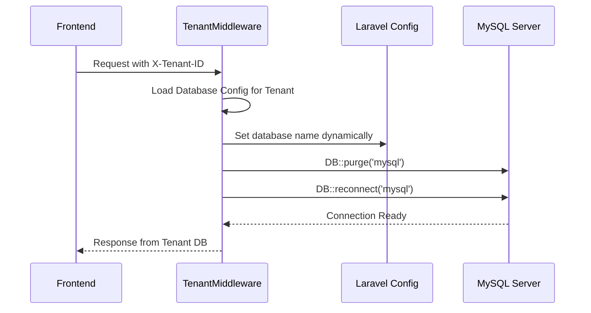
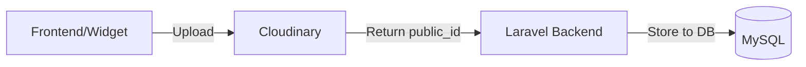

# PISANTRI - Dokumentasi Teknis Mendalam

> **Pesantren Information System and Training Resource Integration**
> Sistem Informasi Pesantren Modern Terintegrasi

---

## 📋 Daftar Isi

| # | Deskripsi | Link |
|---|-----------|------|
| 1 | 🏗️ **Arsitektur Teknis** | [Lihat](#arsitektur-teknis) |
| 2 | 🏢 **Sistem Multi-Tenant** | [Lihat](#sistem-multi-tenant) |
| 3 | ⚙️ **Generic CRUD Engine** | [Lihat](#generic-crud-engine) |
| 4 | 🗺️ **Pemetaan API (Public & Protected)** | [Lihat](#pemetaan-api) |
| 5 | 🛡️ **Sistem Keamanan & RBAC** | [Lihat](#sistem-keamanan--rbac) |
| 6 | ☁️ **Integrasi Media & Cloudinary** | [Lihat](#integrasi-media--cloudinary) |
| 7 | 📊 **Roadmap: Sistem Asesmen Adaptif** | [Lihat](#roadmap-asesmen-adaptif) |
| 8 | 🚀 **Detail Implementasi Lanjutan** | [Lihat](#detail-implementasi-teknis-lanjutan) |

---

## 🏗️ Arsitektur Teknis

PISANTRI menggunakan arsitektur **Decoupled Monolith** dengan Frontend React yang berkomunikasi via REST API ke Backend Laravel.

### 🛠️ Tech Stack Detail
| Layer | Komponen | Teknologi |
|---|---|---|
| 🎨 **Frontend** | UI/UX | React 18, TypeScript, Vite, Tailwind CSS |
| ⚙️ **Backend** | API Logic | Laravel 12, PHP 8.2+ |
| 🗄️ **Database** | Storage | MySQL 8 |
| 🛡️ **Auth** | Security | Laravel Sanctum |
| ☁️ **Media** | Assets | Cloudinary |
| 🔔 **Notif** | Messaging | Firebase FCM |

---

## 🏢 Sistem Multi-Tenant

> [!IMPORTANT]
> PISANTRI menggunakan pendekatan **Database-Level Isolation** (Multi-Database per Tenant). Strategi ini menjamin keamanan data antar lembaga pesantren secara fisik.

### 🔄 Alur & Mekanisme Database Switching
Switching database tidak dilakukan melalui file `.env`, melainkan secara dinamis di level middleware (`TenantMiddleware.php`).

```php
// 1. Ambil ID Tenant dari Request Header
$tenantId = $request->header('X-Tenant-ID');

// 2. Load konfigurasi database spesifik tenant dari array pemetaan
$config = $this->tenantConfigs[$tenantId];

// 3. Update konfigurasi database Laravel secara runtime
Config::set('database.connections.mysql.database', $config['database']);

// 4. PURGE & RECONNECT (Krusial)
// Ini memastikan Laravel memutus koneksi lama dan membuat koneksi baru ke DB yang benar
DB::purge('mysql');
DB::reconnect('mysql');
```



---

## ⚙️ Generic CRUD Engine

Hampir seluruh modul master data di PISANTRI dibangun di atas **Generic CRUD Engine** yang sangat extensible.

### 🍱 Fitur Otomatisasi Mesin CRUD

Hampir seluruh modul master data di PISANTRI dibangun di atas **Generic CRUD Engine** yang bekerja dengan membaca metadata tabel pada `config/crud_tables.php`.

#### Contoh Konfigurasi:
```php
'santri' => [
    'table' => 'tb_santri',
    'title' => 'Data Santri',
    'fields' => [
        'nama_lengkap' => ['type' => 'text', 'required' => true],
        'foto_santri' => ['type' => 'file', 'cloudinary' => true],
    ],
    'relations' => [
        'angkatan_id' => [
            'table' => 'tb_angkatan',
            'key' => 'id',
            'display' => 'nama_angkatan'
        ]
    ]
]
```

| Fitur | Penjelasan Mendalam |
|---|---|
| 🔗 **Dynamic Join** | Otomatis melakukan query ke tabel relasi untuk menampilkan nama (misal: `angkatan_id_nama`) alih-alih hanya ID. |
| ☁️ **Auto-Cloudinary** | Mengidentifikasi field tipe `file` dan menangani proses upload ke Cloudinary beserta penyimpanan `public_id` untuk kebutuhan manipulasi aset. |
| 🛡️ **Role Filtering** | Di level backend, setiap request CRUD divalidasi apakah role user yang sedang login terdaftar dalam `allowed_roles` untuk tabel tersebut. |
| 🌐 **URL Transformer** | Mengubah nama file yang tersimpan di DB menjadi Absolute URL (Cloudinary/Local) secara otomatis sebelum dikirim ke Frontend. |

---

## 🗺️ Pemetaan API

### 1. 🌐 Public Endpoints (Tanpa Auth)
| Endpoint | Deskripsi |
|:---|:---|
| `GET /api/ping` | 💓 Health check sistem |
| `POST /api/auth/login` | 🔑 Autentikasi user |
| `GET /api/public/landing-data` | 🏠 Data landing page |

### 2. 🛡️ Protected Endpoints (Sanctum Required)
| Endpoint Prefix | Deskripsi |
|:---|:---|
| `/api/dashboard/*` | 📊 Statistik role-based |
| `/api/tahfidz/*` | 📖 Manajemen hafalan |
| `/api/presensi/*` | 📲 Absensi QR Code |
| `/api/lms/*` | 📖 Kursus & Materi |
| `/api/roadmap/*` | 🚀 Curriculum Mapping |

---

## 🚀 Mekanisme Pemetaan Roadmap-to-LMS

> [!NOTE]
> Integrasi antara Roadmap (Standard Internasional) dan LMS (Local Content) menggunakan relasi **Many-to-Many**.

- 🔄 **Topic-Course Sync**: Admin menghubungkan Topik Roadmap ke beberapa Course LMS via endpoint khusus.
- 📈 **Progress Aggregation**: Sistem memberikan rekomendasi progress berdasarkan penyelesaian materi di LMS.

---

## 🛡️ Sistem Keamanan & RBAC (Role-Based Access Control)

PISANTRI menerapkan kontrol akses berlapis untuk menjaga integritas data di seluruh tenant.

- 🔑 **Autentikasi**: Menggunakan **Laravel Sanctum** (Bearer Token).
- 👥 **Hierarki Role**: Data master di tabel `users_groups`.
- 🚫 **Write Protection**: Middleware `BlockParentWrite` mencegah role Orang Tua melakukan mutasi data (POST/PUT/DELETE) pada modul sensitif.
- 🚧 **Tenant Guard**: Validasi Cross-Tenant memastikan isolasi data 100%.

---

## ☁️ Integrasi Media & Cloudinary

PISANTRI mengandalkan **Cloudinary** untuk percepatan pengiriman aset gambar (CDN-based).

### 🔄 Workflow Aset


### 💎 Optimasi Gambar Otomatis
| Parameter | Fungsi |
|---|---|
| `f_auto` | Memilih format gambar terbaik (WebP/AVIF). |
| `q_auto` | Kompresi kualitas tanpa merusak visual. |
| `c_fill` | Smart cropping & resizing di sisi server. |

---

## 📊 Roadmap: Sistem Asesmen Adaptif (Future)

Integrasi fitur Asesmen Adaptif (IRT-based) akan menjadi inti pengembangan masa depan:

1.  🎯 **Bank Soal Berparameter**: Setiap butir soal memiliki meta-data Tingkat Kesukaran.
2.  🧠 **Estimasi Kemampuan**: Implementasi library statistik (mirt/ltm) via API.
3.  📈 **Adaptive Dashboard**: Visualisasi kurva karakteristik butir soal bagi pengajar.

---

## 🚀 Detail Implementasi Teknis Lanjutan

### 1. 🔔 Arsitektur Notifikasi (Firebase)
- **Notification Model**: Riwayat tersimpan di `tb_notifications`.
- **FcmService**: Komunikasi real-time dengan Google FCM API.
- **Asynchronous Trigger**: Pengiriman non-blocking untuk performa API responsif.

### 2. ⚖️ Integritas Saldo (Financial Closing)
- 🔒 **Immutable Records**: Transaksi terlapor (`terlapor = 1`) dikunci total.
- ⏭️ **Saldo Forwarding**: Pemindahan saldo otomatis ke periode baru saat tutup buku.
- 📝 **Audit Trace**: Metadata statistik penutupan tercatat permanen.

---

> **Dokumen teknis ini dirancang untuk pengembang sistem PISANTRI agar memahami landasan arsitektur platform.**
> *Last updated: 8 Januari 2026 (Refined Pejabat Panel & Tahfidz Cloning)*
